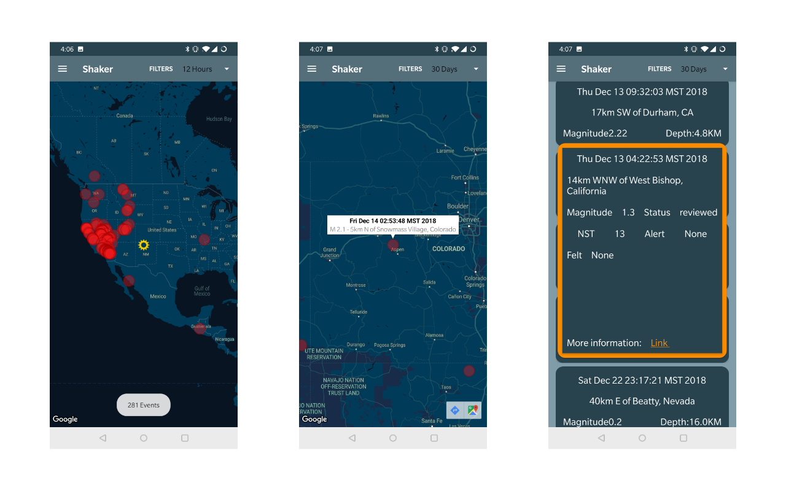

**Hi, I'm Travis Decker. I am a software developer, photographer and explorer. I recently graduated from Deep Dive Coding; a full time intensive boot camp where I learned Java, Android, Git/Version control and a ton more. I am very excited about my new skills and I am eager to find employment... wink wink, nudge nudge. 
Below you will find some information about my different software projects as well as my photography. At the bottom of the page, there are links to my social media accounts to stay up to date, as well as other links to sites or entities I may reference throughout this page.**

## Android Development
I have now published one of my personal projects from the boot camp. "Shaker" is an app that allows users to monitor live earthquake data, courtesy of the United States Geological Survey.

- Download the app: [Google Play Store](https://play.google.com/store/apps/details?id=com.shaker.shaker&hl=en)
- See the source code: [GitHub](https://github.com/TravisDecker/shaker)

#### You can stay up to date with my work on these social media sites:
[GitHub](https://github.com/TravisDecker),
[Linkedin](https://www.linkedin.com/in/travis-decker-9a86a9169/),
[Instagram](https://www.instagram.com/straylensephotography/),
[Twitter](https://twitter.com/T_Ravosaurus)
